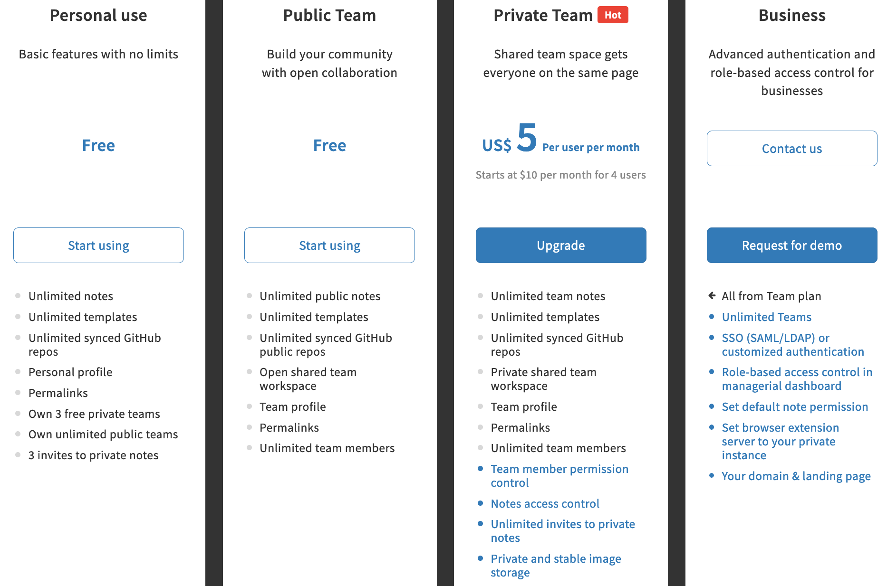

## MiniBaz2020 - HackMD / R Markdown

**Monday 22 June 2020 - 2-4pm** 
**Mik Black, Department of Biochemsitry**

### Overview

This session will focus on the use of Markdown-based document creation.

We will start by introducing Markdown (a basic text-based document-creation language) 
in the context of creating reproducible research documents in R.

But first, let's take a look at a simple document written in markdown:

 * [markdownFile.md](https://github.com/mikblack/MiniBaz2020-HackMD/blob/master/markdownFile.md)

On GitHub, this file is "rendered" as a formated file.

If you click on the "Raw" button, you will see that it is just a text file,
written in Markdown.

### Part One: R Markdown

To learn about using R markdown, we're going to use part of the Software Carpentry 
*R for Reproducible Scientific Analysis* workshop - "Producing Reports With knitr":

https://swcarpentry.github.io/r-novice-gapminder/15-knitr-markdown/index.html

#### A few thoughts:

Benefits of (R) markdown:

 - text-based format (and easy to read)
 - easy to create nicely formatted documents
 - allows you to focus on content, rather than formatting
 - highly portable (e.g., cross-platform)
 - easy for version control (can see exactly which text has changed)

### Part Two: HackMD

While R markdown (or even just straight markdown - you can use "Preview HTML" in RStudio
to render a Markdown document to HTML - it doesn't have to contain R code) is awesome for
creating great looking documents, it doesn't solve the need for *collaborative document editing*.
For this, many people use something like Google Docs or Office 365.

HackMD provides a markdown-based platform for collaboration document editing:

https://hackmd.io/

It is a commercial platform, but provides a free access tier (a subscription provides
additional benefits):

